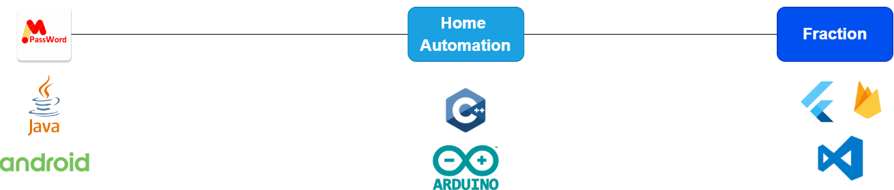

# Hi there, I'm Sudharshan Akshay 

I'm a possionate Developer with experience in React, Angular, Flutter. Welcome to my Github profile!

- 🔭 I’m currently working on 'Fraction' a flutter project
- 🌱 I’m currently learning State management in Flutter applications.
- 💬 Ask me about JavaScript frameworks (React, Angular).
- 📫 How to reach me: [will be registering for social media soon! 😆].

## Projects

Here are some of the projects I've worked on:

- [Fraction](): An shared Expense management app.
- [MakePassword](https://sudharshanakshay.github.io/makepassword/): A Random password generating app.
- [Smart Home Project](https://sudharshanakshay.github.io/The_lazy_Code/): IR- remote to control 4 channel relay.
- [InwardOutward](https://sudharshanakshay.github.io/inwardoutward/): Keep digital logs of all the Incoming & Outgoing Post in an Organisation.

## Github Stats

## Connect with Me

Let's connect and chat! You can find me on:
- [LinkedIn]()

<!--

-->

